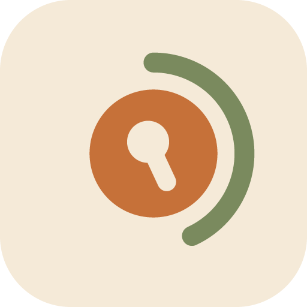

<div align="center">



# Focus Lock

**A focus timer that actually enforces itself.**


</div>

<br>

You set how long you want to concentrate and choose the handful of apps you're allowed to keep —
everything else simply won't open until the time is up. Reach for the app you're trying to avoid
and you get a calm full-screen reminder of how much time is left instead of its feed. Home and
Settings always stay reachable, so you're never locked out of your own phone.

No account, no setup, no internet. Nothing leaves the device.

A Kotlin Multiplatform app: the timer, storage and state live in shared Kotlin, with a native UI
on each platform — Jetpack Compose on Android, SwiftUI on iOS.

<br>

## Screens

<div align="center">

| Home | Settings | Locked |
|:---:|:---:|:---:|
|  |  |  |
| Dial in a duration, glance at what's&nbsp;still allowed, begin. | Your defaults, and how the lock behaves. | Takes over for the whole session. |

</div>

<br>

## What it does

- **Dial in any session** from 5 to 60 minutes, or tap a `15` / `25` / `50` preset.
- **Pick your allowlist** from every app on the phone. Everything else goes quiet for the session.
- **Blocks on sight** — open something off the list and a full-screen card appears instead, showing
  the time remaining and a shortcut back to the apps you *are* allowed.
- **One press to back out.** Press Back once and you leave the blocked app entirely — it closes
  rather than lingering in Recents with a preview of what you were avoiding.
- **Hard to quit by accident.** Ending the whole session early takes a deliberate press-and-hold
  plus a confirmation.
- **Never locks you out.** Your launcher, Settings and keyboard always keep working.
- **Keeps time honestly.** The countdown survives leaving the app, locking the screen, or the app
  being closed entirely.

<br>

## Stack

| | |
|---|---|
| Language | Kotlin 2.4, Swift 5 |
| Shared | Kotlin Multiplatform — Android library, `iosArm64`, `iosSimulatorArm64` |
| UI | Jetpack Compose + Material 3 (Android) · SwiftUI (iOS) |
| Navigation | Navigation Compose |
| State | `ViewModel` + `StateFlow` in common code, Coroutines & Flow |
| Persistence | DataStore Preferences (multiplatform `-core`) |
| DI | Koin — no Hilt, no KSP, no codegen |
| Swift interop | KMP-NativeCoroutines + KMP-ObservableViewModel |
| Blocking | `AccessibilityService` + accessibility overlay — **Android only** |
| Build | AGP 9.3.1, Gradle 9.6.1, version catalog |
| SDK | Android min 24 · target 37 · Java 11 · iOS 16+ |

<br>

## Getting started

**Android**

```bash
./gradlew :androidApp:installDebug
```

Then enable the service once under **Settings → Accessibility → Focus Lock**, or tap **Grant
access** on the in-app banner, which takes you straight there.

**iOS**

Open `iosApp/iosApp.xcodeproj` in Xcode and run. Xcode drives Gradle: a build phase invokes
`:shared:embedAndSignAppleFrameworkForXcode`, which compiles, copies and signs the Kotlin
framework for whichever configuration and architecture is being built.

<br>

## Project layout

```
shared/            Kotlin Multiplatform — Android + iOS
├── commonMain/    domain models, repository contracts, DataStore,
│                  the Koin graph and FocusViewModel
├── androidMain/   SystemClock, filesDir, androidContext()
└── iosMain/       CLOCK_MONOTONIC, NSFileManager, KoinDependencies

androidApp/        the Android app
├── di/            the Android-only half of the Koin graph
├── data/          installed-app lookup, accessibility status
├── service/       the blocker and its full-screen overlay
└── ui/            screens, components, theme

design-system/     the "Organic" design language as plain Kotlin
                   — colour, type, spacing, motion tokens with no
                     Android, Compose or SwiftUI dependency

iosApp/            the SwiftUI app
├── Theme/         the token bindings — the SwiftUI twin of ui/theme
├── Components/    PillButton, OrganicSwitch, CircularDial, ...
└── Fonts/         the same Figtree/Caprasimo faces Android bundles

docs/brand/        the app mark, as an SVG master and a 512 PNG.
                   The launcher, splash and notification drawables
                   it was cut into live in androidApp/src/main/res
```

Three Gradle modules plus an Xcode project. `:design-system` holds the design language on its own,
with no dependency on Android, Compose or SwiftUI — both UIs bind the same tokens, so the visual
language can be swapped or reused without touching a screen.

<br>

## What iOS does and doesn't do

iOS runs the timer, not the lock. Nothing on the platform can block another app the way an
`AccessibilityService` can: the nearest equivalent, Screen Time's `FamilyControls`, is Swift-only,
requires an entitlement granted by Apple, and never reveals which apps the user picked.

So the allowlist and the blocking overlay are Android-only, and `InstalledAppsRepository` and
`AccessibilityStatusChecker` resolve to no-ops on iOS. Everything else — the session model, the
countdown, persistence, the ViewModel and the design tokens — is the same Kotlin on both.

<br>

## License

Not licensed yet — default copyright applies, which makes this source-available rather than open
source. A `LICENSE` file may follow.

**Fonts.** Bundles **Figtree** (© 2022 The Figtree Project Authors) and **Caprasimo**
(© 2023 The Caprasimo Project Authors), both under the SIL Open Font License 1.1. Full texts in
[`licenses/`](licenses), summary in [`NOTICE`](NOTICE).
