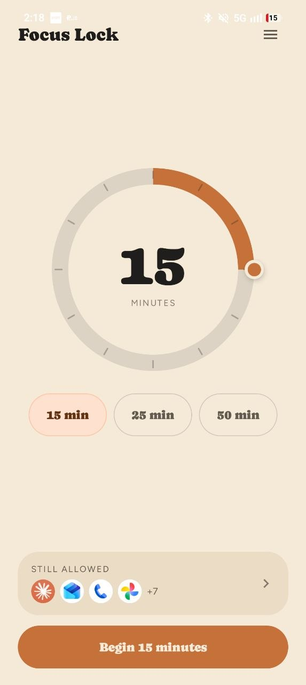
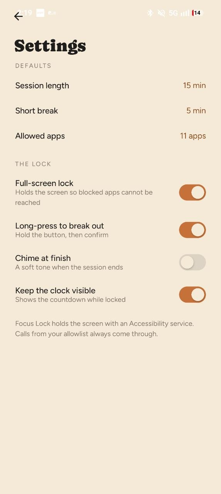
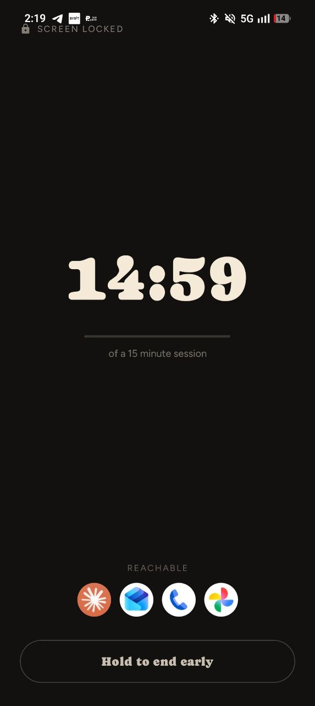
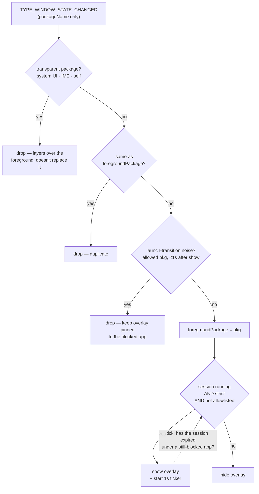
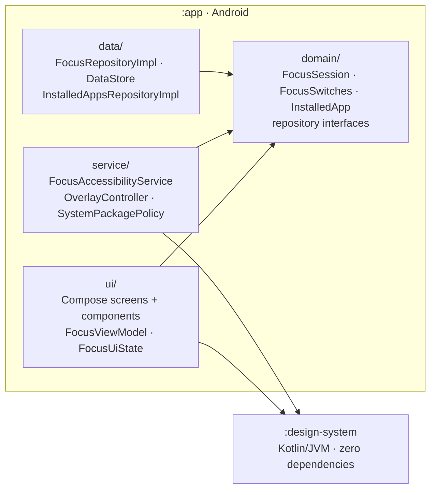

# Focus Lock

A Pomodoro timer that actually holds the line. Pick a duration, pick the handful of apps you're
allowed to keep, hit **Begin** — and for the rest of the session every other app is met with a
full-screen block instead of its home feed.

Blocking is done with an Android **AccessibilityService**, which is the part worth being sceptical
about, so here is the short version up front: the service is configured with
`canRetrieveWindowContent="false"` and reads exactly one field off each event —
`event.packageName`. It cannot see your screen, and the app declares **no `INTERNET` permission at
all**, so nothing it observes could leave the device even if it wanted to.

---

## Screens

| Home | Settings | Locked |
|:---:|:---:|:---:|
|  |  |  |
| Set the time, glance at what's still allowed, begin. | Defaults up top, the four lock behaviours below. | Takes over the whole app for the duration. |

Five surfaces in all. Four live inside the app; the fifth is drawn by the accessibility service on
top of whatever you just tried to open.

| Screen | What you're looking at |
|---|---|
| **Home** | Warm sand background, the app name, and a hamburger into Settings. Centre stage is a **circular dial** you drag to set the duration, with `15 / 25 / 50 min` preset pills beneath it. Along the bottom, a **Still allowed** dock preview (tap it to edit) and a full-width **"Begin *n* minutes"** button that names the duration you've dialled in. If the accessibility service isn't enabled yet, a peach banner sits under the header explaining why it's needed, with a **Grant access** button that deep-links straight into system Accessibility settings. |
| **Allowed apps** | A back arrow, the heading *"Allowed apps"*, and the subtitle *"Everything else goes quiet and unopenable until the timer ends."* Below it, every launchable app on the device in a scrolling list — each row the app's real launcher icon (falling back to a tinted initial-letter monogram if it can't be resolved), the app label, its package name underneath, and a pill switch on the right. Your own app is filtered out of the list. |
| **Locked** | Takes over the whole app the moment a session starts, replacing the nav graph entirely rather than being pushed onto it. Near-black (`#131110`) with cream text: a small padlock and `SCREEN LOCKED` label up top, an enormous `MM:SS` countdown in the display face, the row of allowed apps as a dock, and a **hold-to-confirm** button at the bottom that requires a sustained ~1.2s press before it even offers the confirmation sheet. |
| **Blocked** | The one you see *outside* the app. Same near-black treatment as Locked, so it reads as the same surface following you around. Shows the blocked app's first initial in a circle, its name, the remaining countdown, your allowed-app dock as an escape route, a **Back to focus** button, and the same hold-to-end control. The Back key is swallowed; it does not dismiss. |
| **Settings** | Two labelled groups. **Defaults** reads back your current session length, the short-break length, and how many apps are on the allowlist. **The Lock** is four toggle rows — *Full-screen lock*, *Long-press to break out*, *Chime at finish*, *Keep the clock visible* — each with a one-line explanation underneath. A footer note states plainly that the screen is held with an Accessibility service. |

*Allowed apps and Blocked aren't pictured above — drop `allowlist.jpg` / `blocked.jpg` into
`docs/screenshots/` and add two more columns when you grab them.*

### The look

One design language, "Organic": warm paper (`#F5EAD8`) and sand (`#EBDDC5`) for the calm screens,
ink (`#201E1D`) for text, terracotta (`#C67139`) and olive (`#7A8A5E`) accents over 100–900 ramps,
and a deliberate inversion to near-black for anything that means *you are locked*. Type is
**Caprasimo** for display and **Figtree** for body.

---

## How the blocking works

The interesting problem is knowing which app is in the foreground without asking for invasive
permissions. Focus Lock does it by listening for `TYPE_WINDOW_STATE_CHANGED` and reading only the
package name off the event — no `PACKAGE_USAGE_STATS`, no `SYSTEM_ALERT_WINDOW`, no window content.

The block itself is a `TYPE_ACCESSIBILITY_OVERLAY` window, a type that a bound AccessibilityService
may add without `SYSTEM_ALERT_WINDOW`, and which the system tears down automatically if the service
is ever unbound — so the app cannot leave a stuck overlay on your device.



Two details that are easy to get wrong and are called out in the source:

- **Not every window event is an app switch.** System UI, keyboards, and the overlay's own window
  all raise `WINDOW_STATE_CHANGED` while the app underneath stays exactly where it is. Treating one
  as a foreground switch tears the overlay down, re-exposes the blocked app, which re-fires its own
  event, which re-shows the overlay — a permanent flicker. `SystemPackagePolicy` classifies those
  packages as *transparent* and drops their events outright.
- **The ticker must not re-decide what's in front.** It evaluates the package the overlay was raised
  for, captured at show time. Its only job is noticing the session expiring underneath a
  still-blocked app.

The overlay is a Compose composition hosted outside any Activity, so `OverlayLifecycleOwner` drives
`Lifecycle` / `ViewModelStore` / `SavedStateRegistry` by hand in the same order `ActivityThread`
would — otherwise `LaunchedEffect`, `DisposableEffect` and friends have no owner to attach to.

### Escape hatches

A focus app that can lock you out of your own phone is a bug, not a feature. Three packages are
always reachable regardless of the allowlist: your **launcher** (Home always works), the **Settings**
app (resolved dynamically, since OEMs rename it), and Focus Lock itself. Every enabled **keyboard**
is exempt too — an IME reports its own package as foreground the instant a text field is focused.

---

## Architecture

Two Gradle modules, and a strict rule about which way dependencies point.



**`:design-system`** is a plain Kotlin/JVM module — no Android Gradle plugin, no `res/`, and no
production dependencies (JUnit for tests is the only entry in its build file). It expresses the whole design language as `value class` tokens over JVM
primitives, so it's unit-testable without Robolectric and portable to any renderer. The Compose
binding lives entirely in `app/src/main/java/.../ui/theme/`. See
[`design-system/README.md`](design-system/README.md).

**`:app`** follows a light Clean-Architecture split. `domain/` holds pure models and repository
*interfaces* and knows nothing about Android; `data/` implements them; `ui/` and `service/` are the
two independent consumers.

### State: one source of truth, two consumers

The subtle constraint is that the Activity and the AccessibilityService are separate Android
components that must never disagree about whether a session is running — and DataStore permits only
one instance per file.

`AppContainer` is built once in `Application.onCreate()`, which the platform guarantees runs before
any Service's `onCreate()`, so both sides reach the *same* singleton repository and the same
DataStore. Manual DI, deliberately: no Hilt, no KSP, no annotation processing in the build.

```
DataStore ──> FocusRepository ──┬──> FocusViewModel ──> FocusUiState ──> Compose screens
   (session, allowlist,         │       (+ 1s ticker)
    4 setting switches)         │
                                └──> FocusAccessibilityService ──> block decision + overlay
```

`FocusSession` carries an **absolute** `endElapsedRealtimeMs` rather than a countdown that ticks
down. `isRunning` and `remainingSeconds` are derived from it on demand, so the ViewModel and the
service compute the same answer independently and backgrounding causes no drift. It also clamps
against `totalSeconds`: a remaining value larger than the original duration proves
`elapsedRealtime` reset under us (a reboot), and the session is treated as expired rather than
resurrected.

---

## Stack

| | |
|---|---|
| Language | Kotlin 2.2.10 |
| UI | Jetpack Compose (BOM 2026.02.01), Material 3 |
| Navigation | Navigation Compose 2.9.8 |
| State | `ViewModel` + `StateFlow`, `collectAsStateWithLifecycle` |
| Async | Coroutines + Flow |
| Persistence | DataStore Preferences 1.2.1 |
| DI | Manual (`AppContainer`) — no Hilt, no KSP |
| Blocking | `AccessibilityService` + `TYPE_ACCESSIBILITY_OVERLAY` |
| Build | AGP 9.3.1, Gradle 9.5.0, version catalog, configuration cache on |
| SDK | `minSdk` 24 · `targetSdk` / `compileSdk` 37 · Java 11 |

---

## Build and run

```bash
git clone <your-repo-url>
cd YetAnotherPomo
./gradlew :app:installDebug
```

Then enable the service once: **Settings → Accessibility → Focus Lock**, or tap **Grant access** on
the in-app banner, which deep-links there. The app re-checks on every `ON_RESUME`, so the banner
disappears as soon as you come back.

```bash
./gradlew :design-system:test      # pure JVM, no emulator needed
./gradlew :app:assembleDebug
```

Release builds are **unsigned** — this repo contains no keystore and no signing config. Add your own
if you intend to distribute; `keystore.properties` and `*.jks` are already gitignored.

---

## Permissions

The manifest declares **no runtime permissions and no `INTERNET`**. It contains only:

- `BIND_ACCESSIBILITY_SERVICE` on the service — a permission the *system* holds, not the app; it
  simply guarantees nothing but the system can bind it.
- A `<queries>` block for `MAIN`/`LAUNCHER`, `MAIN`/`HOME`, and the two settings intents — the
  package-visibility declarations needed to list launchable apps and resolve the launcher and
  Settings packages on API 30+.

Everything the app stores — chosen duration, allowlist, four toggles, and a session end timestamp —
lives in a local DataStore file. Note that `android:allowBackup="true"` is currently set with empty
backup rules, so that file participates in Android cloud backup; set it to `false` or write
exclusion rules if you'd rather it didn't.

---

## Project layout

```
app/src/main/java/com/tora/yetanotherpomo/
├── FocusLockApplication.kt      builds AppContainer before any component starts
├── MainActivity.kt              single Activity, edge-to-edge, Compose-only
├── di/AppContainer.kt           manual singletons
├── domain/                      pure models + repository interfaces
├── data/                        DataStore, PackageManager, accessibility status
├── service/                     the blocker
│   ├── FocusAccessibilityService.kt   event → foreground → block decision
│   ├── SystemPackagePolicy.kt         allowlisted vs. transparent packages
│   ├── OverlayController.kt           the TYPE_ACCESSIBILITY_OVERLAY window
│   ├── OverlayLifecycleOwner.kt       Compose lifecycle outside an Activity
│   └── BlockedOverlayContent.kt       what the overlay draws
└── ui/                          ViewModel, nav graph, screens, components, theme binding

design-system/src/main/kotlin/com/tora/organic/
├── DesignSystem.kt              the aggregate contract
├── OrganicDesignSystem.kt       the only file with concrete values
└── tokens/                      colour, type, dimension, motion, opacity primitives
```

---

## License

**TODO — this project does not have a license yet.** Without one, default copyright applies and
nobody can legally fork, modify, or contribute. Add a `LICENSE` file before publishing.

### Third-party

Bundled fonts, both under the SIL Open Font License 1.1 — see [`NOTICE`](NOTICE) and
[`licenses/`](licenses):

- **Figtree** — Copyright 2022 The Figtree Project Authors
- **Caprasimo** — Copyright 2023 The Caprasimo Project Authors
